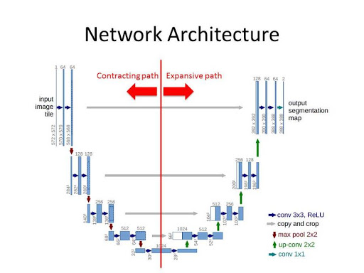

# Final Assignment 
  
:arrow_right: Link to Custom Dataset: https://drive.google.com/drive/folders/1RbJHVxo91jhekv3_E9GZvujUDNDaxFQu

:arrow_right: Link to how the Dataset was created: https://github.com/Deeksha-Pandit/EVA4-S14/blob/master/Final/README.md 

:arrow_right: **Files Used:**

:arrow_right: **Data Formats:**

All our images are in .jpg format
This was done to keep our dataset to a minimum size for further computations.

:arrow_right: **Fetching the Data:**
- So the biggest challenge of this assignment was how to load such huge amount of data ?
- First, I tried to load a small amount of data (say 20 images of each kind) into colab
- Then I tried to convert them into numpy arrays and tried to store them in a list - since we have to input 4 kind of images
- After storing in a list, when I tried to retrieve the images via these numpy arrays, I landed up in a lot of errors due to channel mis-match and resizing issues
- This created a lot of confusion and I thought I would give up on the whole assignment because I was stuck with errors for days
- Then I decided to finally change my approach and restarted the whole assignment from scratch
- This time I thought of loading the paths of the dataset into colab instead of saving them in a list and converting to arrays etc
- I stored the paths of the 4 kinds of images in variables and extracted each of these paths locally into colab
- This saves a lot of time and RAM , it just takes 3-4 mins to extract the zip files into colab without eating away any RAM space
- Such a relief, I could finally get hold of the dataset

:arrow_right: **Custom Dataset class:**
- I wrote a class named CustomDataset
- It contains __init__ method to initialise the transforms and also the 4 file paths which were created with the 4 types of files
- Also containts __len__ to store fg_bg length
- The __getitem__ function containts 'bg_index' which makes sure that each of the 100 background images is mapped to each of the fg-bg, fg-bg-mask and depth images
- This was done by using: bg_index = index//4000 (i.e for 1 bg images 4000 fg-bg (and mask and depth) would be mapped)
- Code snippet:
- Also if any transforms were available, the transforms would be applied to the images at this point in the code

:arrow_right: **Albumentations:**

:arrow_right: **Train Test Split:**
- So the requirement was to split the whole 400k dataset into 70:30 :: train:test
- As we had also done this for imagenet dataset in previous assignment, I implemented it in the same way
- First I split the len() of whole dataset into 70% and then the remaining 30% would be the test data
- Then after this I ran random_split() functionality on these 70:30 split images - to generate random images for test and train
- However, this was generating random images for every batch and so I had to use SEED: timetorch.manual_seed(0) so that a fixed set of images are generated per batch
- And then applied random_split() after SEED

:arrow_right: **Dataloader:**
- Then called the DataLoader item twice - once for train set and once for validation set
- First, I experimented for images of size (resized) 64x64 (to test with reduced size images) - for this I gave a larger batch_size of about 128
- This worked well , and was faster
- Then as for transfer learning, I did not resize the images but had to reduce batch_size greatly and made it 32 (so that cuda does not run out of memory)
- This completed the data loading process 

:arrow_right: **UNet model:**
- Link to my model: 
- So after trying various models available, I choose to work with UNet model
- I tried using ResNet like our previous assignments and also various types of Autoencoders - but the results never looked good and I had lot of difficulties dealing with the input data
- UNet is also and encoder-decoder model and I choose this because it is used to predict very minute data in medical field like tumur and cell detection
- No dense layer in UNet model, so images of different sizes can be used as input - So I first tried running the model on 64x64 size images and then switched to the 224x224 images of our dataset (transfer learning)
- The only change I had to make was pass two images in the model summary instead of one (which we were passing earlier)
```summary(model, input_size=[(3,64,64),(3,64,64)])```
- Architecture of model:



The U-Net architecture is built upon the Fully Convolutional Network and modified in a way that it yields better segmentation in medical imaging. Compared to FCN-8, the two main differences are 

(1) U-net is symmetric and  
(2) the skip connections between the downsampling path and the upsampling path apply a concatenation operator instead of a sum.

These skip connections intend to provide local information to the global information while upsampling. Because of its symmetry, the network has a large number of feature maps in the upsampling path, which allows to transfer information. By comparison, the basic FCN architecture only had number of classes feature maps in its upsampling path. The U-Net owes its name to its symmetric shape, which is different from other FCN variants.

U-Net architecture is separated in 3 parts:

  1) The contracting/downsampling path
  2) Bottleneck
  3) The expanding/upsampling path

- However, for our assignement, I have made a few changes in the model:
  1) I first have some common layers for both depth and mask images (common layers I choose are: down1, down2 and down3)
  2) Then I split the layers into two - one set for mask and another set for depth images
  3) For this I choose the remaining layers and changed the sizes accordingly so that it duplicated the UNet architecture
  4) While running the model for depth images, I first frooze the mask layers which were newly created the ran the model and obtained     the results. 
  5) While running the model for mask images, I frooze the depth layers which were newely created and ran the model to obtain results
  6) To freeze the code, used this code:
  
```
#Freeze the layers
count = 0
for child in model.children():
   count += 1
   if count < 4 or count > 10:
     for param in child.parameters():
         param.requires_grad = False
```

- Finally the model would return logits_mask if we are running model for mask images or it would return logits_depth if we are running model for depth images
- So this is all about the model. It was not that easy, with a lot of research and trail and error these changes were made :performing_arts:

:arrow_right: **Train and Test:**
- Train and test functions do not change much, they are similar to what we used in previous assignments
- In these functions we load each of the 4 types of images (background, fg-bg, fg-bg-mask and depth images)
- And then here comes another hurdle................ :construction:
- We had to decide upon the hyperparameters for the training and testing, that would work perfectly with our model :thinking:
- I tried with quite a few loss functions:
  1) MSELoss() - Did not give good results
  2) CrossEntropyLoss() - Did not fit best for our dataset images
  3) BCEWithLogitsLoss() - This worked best for mask images and this is the loss function I used for mask images , but for depth images   it gve this kind of output: 

